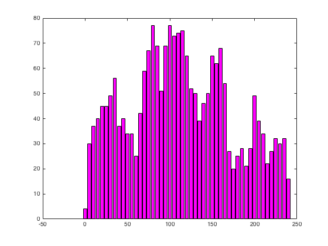
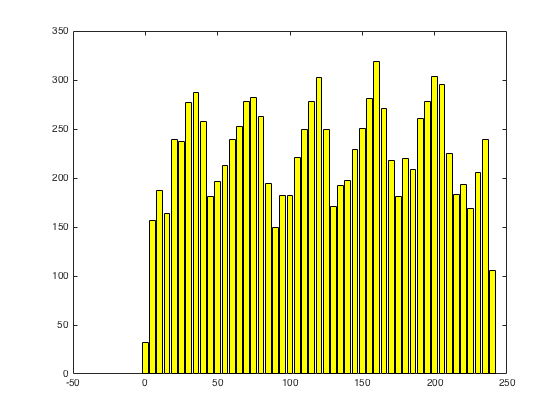

# Markdown

Quer?a dejar registrado el procesamiento del dataset BCI Competition II b 2002

Este famoso dataset esta compuesto de un solo sujeto en tres sesiones.

El protocolo es similar al de Donchin et al: la matriz tipica de p300

%FOOD MOOT HAM PIE CAKE TUNA ZYGOT 4567

S = 'FOODMOOTHAMPIECAKETUNAZYGOT4567';

CF = [];

SP = 'ABCDEFGHIJKLMNOPQRSTUVWXYZ123456789_';

```matlab
SPELLERMATRIX = { { 'A','B','C','D','E','F'},
                { 'G','H','I','J','K','L'},
                { 'M','N','O','P','Q','R'},
                { 'S','T','U','V','W','X'},
                { 'Y','Z','1','2','3','4'},
                { '5','6','7','8','9','_'}};
```

donde las filas estan numeradas del 7 al 12 y las columnas del 1 al 6.

El dataset esta compuesto de tres sesiones (la 10, la 11 y la 12), donde las dos primeras son de 
entrenamiento (son las que se distribuyeron en el challenge) y la ultima
es la que habia que utilizar para decodificar el mensaje.

Para cada sesion, hay una serie de runs, que son agrupados de trails.  Cada
trial esta definido como un intento de decodificar una letra.

Cada trial esta compuesto de 15 repeticiones de secuencias de 12 flashs, que 
corresponden a las permutaciones de las 12 elecciones, 6 filas y 6 columnas.

Para cada una de las 15 repeticiones de 12 de cada trial, la fila o la 
columna flashea durante 0.1 s, seguido de un periodo de descanso de 0.075 s.
Los flashes se generan a F = 5.7 Hz.

El dataset fue obtenido con 64 canales diferentes y a Fs = 240 Hz.

El total de trials es entonces de 73 = 42 + 31.

Los trials de entrenamiento representan el mensaje:

```matlab
% CAT DOG FISH WATER BOWL HAT HAT GLOVE SHOES FISH RAT

% Sesion
% 10        1   3 CAT
% 10        2   3 DOG
% 10        3   4 FISH
% 10        4   5 WATER
% 10        5   4 BOWL
% 11        1   3 HAT
% 11        2   3 HAT
% 11        3   5 GLOVE
% 11        4   5 SHOES
% 11        5   4 FISH
% 11        6   3 RAT

% 10 + 11 = 42 

Los trials correspondientes al testeo tienen el mensaje
% FOOD MOOT HAM PIE CAKE TUNA ZYGOT 4567
% 12 1 4
% 12 2 4
% 12 3 3
% 12 4 3
% 12 5 4
% 12 6 4
% 12 7 5
% 12 8 4

% 12 = 31
```

En el trial 40, es decir el primer trial del run 6 de la sesion 11 tiene un 
'glitch' ya que hay 181 flashes (180=15x12) y el flash 99 del estimulo 6 se
repite en el fash 11 con el mismo estimulo.  Asi entonces el flash 99 hay que
descartarlo.

El codigo para segmentar y preprocesar los flashes esta [aca](loadBCICompetition.m)

##?Histogramas de localizaciones

El P300 se define primero por su localizacion; es un evento ''time-locked'' al
inicio del estimulo recibido.  Ahora se sabe que es mas complejo y en realidad 
son dos (P3a y P3b) y para algunos autores tres.  Basicamente tiene que ser un 
pico positivo a los 0.3 s despues de que arranca el estimulo.  Lotte et al 
detallan en su buen libro que puede verificarse mediante el histograma de los
picos obtenidos de cada segmento posterior a cada uno de los flashes.  Si 
se separan los picos hit (deberian contener el p300) de aquellos no-hit 
(no lo deberian contener) deberia notarse alguna diferencia.

Es decir, para cada segmento se busca el pico principal del segmento.  De ese pico
se obtiene la amplitud y la localizacion (en relacion al inicio del segmento que
coincide con el inicio del estimulo).  De esos valores se guardan todos los 
correspondientes a segmentos hits y tambien aquellos no-hits.

El histograma para P300:



El histograma para los no-hits:



Se ve entonces que para p300:

 *Hay menos picos a los 0.2 s.
 *Entre los 0.29 s y los 0.68 s hay mas picos.
 *A los 0.75 s hay menos otra vez, muchos menos.

Control: randomizando los labels se ve el mismo patron que en nohit.


