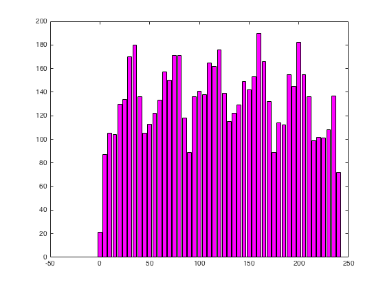
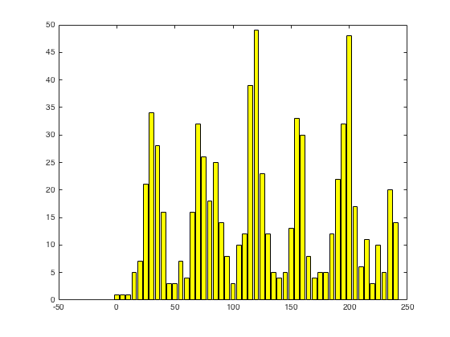
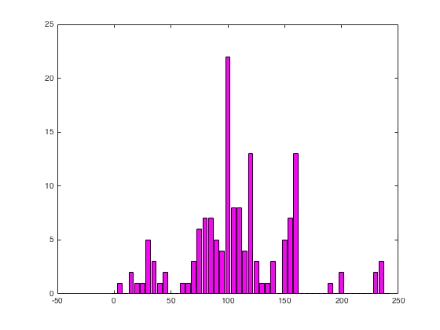
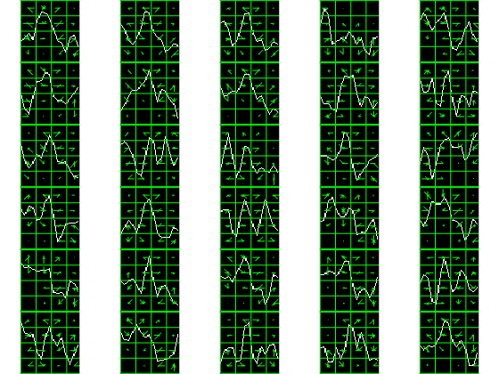
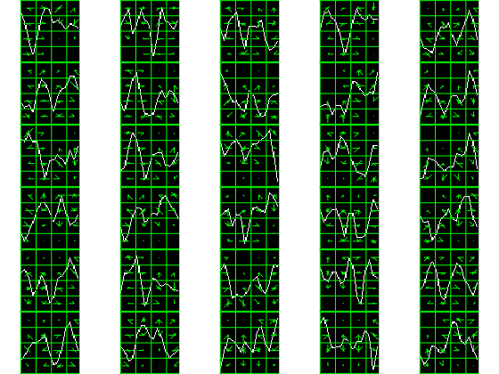

# Analisis del p300 de BCI Competition II B

Queria dejar registrado el procesamiento del dataset [BCI Competition II b 2002](http://www.bbci.de/competition/ii/results/#albany2) 

Este famoso dataset esta compuesto de un solo sujeto en tres sesiones.

El protocolo es similar al de Donchin et al: la matriz tipica de p300

```matlab
SPELLERMATRIX = { { 'A','B','C','D','E','F'},
                { 'G','H','I','J','K','L'},
                { 'M','N','O','P','Q','R'},
                { 'S','T','U','V','W','X'},
                { 'Y','Z','1','2','3','4'},
                { '5','6','7','8','9','_'}};
```

donde las filas estan numeradas del 7 al 12 y las columnas del 1 al 6.

El dataset esta compuesto de tres sesiones (la 10, la 11 y la 12), donde las dos primeras son de 
entrenamiento (son las que se distribuyeron en el challenge) y la ultima
es la que habia que utilizar para decodificar el mensaje.

Para cada sesion, hay una serie de runs, que son agrupados de trails.  Cada
trial esta definido como un intento de decodificar una letra.

Cada trial esta compuesto de 15 repeticiones de secuencias de 12 flashs, que 
corresponden a las permutaciones de las 12 elecciones, 6 filas y 6 columnas.

Para cada una de las 15 repeticiones de 12 de cada trial, la fila o la 
columna flashea durante 0.1 s, seguido de un periodo de descanso de 0.075 s.
Los flashes se generan a F = 5.7 Hz.

El dataset fue obtenido con 64 canales diferentes y a Fs = 240 Hz.

El total de trials es entonces de 73 = 42 + 31.

Los trials de entrenamiento representan el mensaje:

```matlab
% Training: CAT DOG FISH WATER BOWL HAT HAT GLOVE SHOES FISH RAT

% Sesion
% 10        1   3 CAT
% 10        2   3 DOG
% 10        3   4 FISH
% 10        4   5 WATER
% 10        5   4 BOWL
% 11        1   3 HAT
% 11        2   3 HAT
% 11        3   5 GLOVE
% 11        4   5 SHOES
% 11        5   4 FISH
% 11        6   3 RAT

% 10 + 11 = 42 

Los trials correspondientes al testeo tienen el mensaje
% Testing: FOOD MOOT HAM PIE CAKE TUNA ZYGOT 4567
% 12 1 4
% 12 2 4
% 12 3 3
% 12 4 3
% 12 5 4
% 12 6 4
% 12 7 5
% 12 8 4

% 12 = 31
```

En el trial 40, es decir el primer trial del run 6 de la sesion 11 tiene un 
'glitch' ya que hay 181 flashes (180=15x12) y el flash 99 del estimulo 6 se
repite en el fash 11 con el mismo estimulo.  Asi entonces el flash 99 hay que
descartarlo.

El codigo para segmentar y preprocesar los flashes esta [aca](loadBCICompetition.m)

## Histogramas de localizaciones

El P300 se define primero por su localizacion; es un evento ''time-locked'' al
inicio del estimulo recibido.  Ahora se sabe que es mas complejo y en realidad 
son dos (P3a y P3b) y para algunos autores tres.  Basicamente tiene que ser un 
pico positivo a los 0.3 s despues de que arranca el estimulo.  Lotte et al 
detallan en su buen libro que puede verificarse mediante el histograma de los
picos obtenidos de cada segmento posterior a cada uno de los flashes.  Si 
se separan los picos hit (deberian contener el p300) de aquellos no-hit 
(no lo deberian contener) deberia notarse alguna diferencia.

Es decir, para cada segmento se busca el pico principal del segmento.  De ese pico
se obtiene la amplitud y la localizacion (en relacion al inicio del segmento que
coincide con el inicio del estimulo).  De esos valores se guardan todos los 
correspondientes a segmentos hits y tambien aquellos no-hits.

El histograma para P300 (canal 20)


El histograma para los no-hits:


Control: randomizando los labels se ve el mismo patron en los segmentos de p300 
que los que tienen nohit.



Se ve entonces que para p300:

* Hay menos picos a los 0.2 s.
* Entre los 0.29 s y los 0.68 s hay mas picos.
* A los 0.75 s hay menos otra vez, muchos menos.

De alguna manera esto es lo que hay que tratar de buscar.

### Single Trial 
Estos histogramas se obtuvieron en base a las senales directas sin ningun tipo
de promedio p.t.p. --> Ergo, picos encontrados cerca de 0.2 o cerca de 0.75 
me dirian que ese segmento tiene ''MENOS'' chances de ser un P300 (o algo asi). 

? Como se ven estos histogramas haciendo promediados p.t.p ?

P300



No Hit



Se ve todavia mas marcado el mismo patron.

? Como puedo implementar un p300 speller basico online real ?
Bueno, puedo tomar cada una de las doce filas, hago las 15 repeticiones, 
armo este histograma y para las clases (1-6) o (7-12) que tenga esta forma 
identifico que ese es el p300.

## Clasificacion con SIFT

? Que tal se clasifica ?

Primero quiero hacer un ejercicio simple de ver si esta todo ok. 

Tomando los 73 trials para entrenamiento pero testeo sobre el conjunto de 
testing de 31

```matlab
Building Test Matrix M for Channel 1:372 (31*(10+2))
Building Descriptor Matrix M for Channel 1:730 (73*10)
Building Descriptor Matrix M for Channel 1:146 (73*2)

Tomando kNN con k=1 (solo el descriptor mas cercano). 

Logicamente da clasificacion perfecta:
C =

   310     0
     0    62
```

y todas las metricas de performance dan perfecto (AUC,ACC)

Y adivino perfectamente la frase:

```matlab
>> Speller{1}

ans = 

  Columns 1 through 8

    'F'    'O'    'O'    'D'    'M'    'O'    'O'    'T'

  Columns 9 through 16

    'H'    'A'    'M'    'P'    'I'    'E'    'C'    'A'

  Columns 17 through 24

    'K'    'E'    'T'    'U'    'N'    'A'    'Z'    'Y'

  Columns 25 through 31

    'G'    'O'    'T'    '4'    '5'    '6'    '7'
```

? Que pasa si no hago trampa ?

Aca se ven los pingos, y lamentablemente no funca bien.


```matlab
Building Test Matrix M for Channel 1:372
Building Descriptor Matrix M for Channel 1:420
Building Descriptor Matrix M for Channel 1:84
Bag Sizes 420 vs 84 
Classifying features 2
Channel 1 -------------

C =

   272    38
    32    30


ans =

    0.8118    0.4839
```

El Accuracy cae al 81, pero la tasa de acierto de p300 al 48%.

La frase que acierta es la siguiente (teniendo en cuenta que cuando no acierta
como p300 ninguno de los grupos de 6 hay que poner uno al azar)

```matlab
>> Speller{1}

ans = 

  Columns 1 through 8

    'E'    '1'    'A'    '7'    'L'    'Q'    'R'    'K'

  Columns 9 through 16

    '8'    'E'    'A'    'Q'    'I'    'A'    'B'    'F'

  Columns 17 through 24

    'K'    'C'    '8'    'E'    'M'    '6'    'L'    '5'

  Columns 25 through 31

    'A'    '1'    'W'    '4'    '3'    '7'    '8'

```

Acierta solo 3 (0.09%).

Fijense los parches de los descriptores.  Los de p300 se ven bien:



Los no-hits son siempre mas difusos (con algunos parecidos a p300).




Conclusiones:

* P300 esta presente en este dataset.  Pude obtener algun parametro de donde esta y alguna caracterizacion.
* Es un concurso de 15 anios y tiene varios resultados que 'promediando' obtuvieron 100% de exito en predecir la palabra.
* Si se habla de un speller p300 no hay medida mas clara que la medida de acierto de la palabra a adivinar.
* Usar el aspecto morfologico de la senial (pattern matching) es desafiante con p300.  Dejo en el apendice la lista de todas las cosas que probe.


### Apendice: Todo lo probado

* Radio test para la clasificacion en base a un threshold.
* Unidades de distancia en base normalizada a la distancia media de cada bolsa
* Ecualizar la imagen y upsamplear la senial previo a la generacion de la imagen (mejora la forma)
* Utilizacion de cada repeticion y de el promedio para armar bolsas mas ricas.
* Generar imagenes donde el escalado horizontal esta separado del vertical.
* Desbalanceo eliminando al azar los descriptores que sobran de la bolsa mas grande.
* Iterativamente reconocer los descriptores que clasifican mal y eliminarlos en forma iterativa.
* Ubicacon del parche: ajuste con zerolevel (vertical) y qKS (horizontal)
* Cambiar el K de kNN a 3,5 y 7 (Con k != 1 la regularizacion nunca da perfecto)
* Usar convolucion convexa para generar mas seniales y asi balancear las bolsas (SMOTE no lo pudimos usar)
* Clasificar single trial basado en imagenes de seniales promediadas.
* Realizar el promedio p.t.p en base a diferentes canales (hacer el promedio horizontal).
* Diferentes parametros de imagen y parches ( 3 3 y 4 4 es el que mejor da).
* Usar mas de un qKS (poner varios de forma que no se solapen).
* Reprogramar el histograma de SIFT para que permita escalas independientes en X e Y.
* Aplicacion de ZSCORE para normalizar la senial (aplicar ZSCORE robusto).
* Eliminado el problema de la varianza ya que SIFT es muy sensible a la varianza de la senial.
* Implementar una clasificacion unaria identificando simplemente de las 6 clases cual es la que tiene el p300.  Hacerlo en base al histograma de distancias y tambien en base a la identificacion de la distancia mas corta)
* Enriquecer la senial de P300 con una senial de p300: Mejora !
* Realizar promedios p.t.p. basados en la mediana. Basados en dynamic time warping (DTW).
* Eliminacion de artefactos (con/sin)
* Ajustas el BASELINE REMOVAL  e implementarlo antes de aplicar los filtros.  Probar sacandolo.
* Cruzar longitudinalmente los descriptores para identificar los otros sujetos generando mas descriptores.
* Invertir la clasificacion de NBNN (cual es la imagen query y cual es la base de datos).
* Cambio del kernel de NBNN.
* Eliminacion de las seniales que tienen una "varianza distorsionada"
* Ensemble Classifier (votacion) en base a los diferentes canales.
* Utilizar el descriptor de HOG (en vez del de SIFT)
* Ejecucion del codigo para obtener tambien la orientacion "sugerida" para cada descriptor.
* Pruebas en diversas OCTAVAS.
* Descriptor rectangular.

